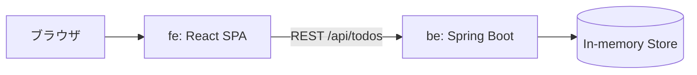

# アーキテクチャ

## 全体像

## バックエンド API

| メソッド | パス | 説明 |
|---|---|---|
| GET | `/api/todos` | TODO 一覧 |
| GET | `/api/todos/{id}` | TODO 取得 (無ければ 404) |
| POST | `/api/todos` | TODO 作成 (`{"title": "..."}`) |
| POST | `/api/todos/{id}/complete` | 完了にする |
| DELETE | `/api/todos/{id}` | 削除 |

タイトルが空の場合は `400 Bad Request` と `{"error": "..."}` を返します。

## フロントエンド コンポーネント

| コンポーネント | 説明 |
|---|---|
| `Button` | primary / secondary / danger の 3 種類のボタン |
| `TodoList` | TODO の追加・完了切替・削除 |

各コンポーネントの見た目は Storybook で確認できます (ポータルからリンク)。
