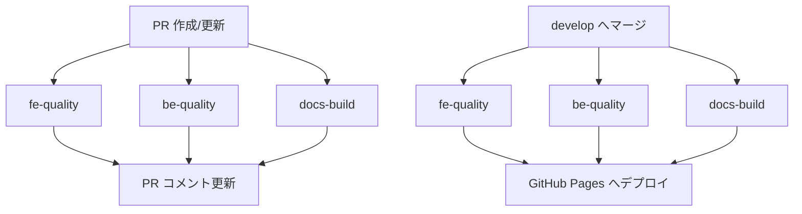

# CI/CD

## ワークフロー構成

| ファイル | トリガー | 役割 |
|---|---|---|
| `pr-quality.yml` | PR 作成・更新 (`develop` / `main` 宛) | FE・BE・Docs をチェックし、結果を PR にコメント |
| `pages.yml` | `develop` への push (マージ) | 同じチェックを実行し、レポートと Docs を Pages に公開 |
| `fe-quality.yml` | 再利用ワークフロー | FE の各ツールを実行・集計 |
| `be-quality.yml` | 再利用ワークフロー | BE の各ツールを実行・集計 |
| `docs-build.yml` | 再利用ワークフロー | MkDocs のビルド (`--strict`) |

## PR 画面での表示

1. **PR コメント** — 品質ゲートの合否と各ツールの結果表、指摘の詳細 (折りたたみ) を 1 つのコメントにまとめ、push のたびに上書き更新します。
2. **Checks タブ** — FE / BE のテスト結果を `dorny/test-reporter` でテストケース単位に表示します。
3. **ジョブ Summary** — 各ジョブの実行ページにも同じ表を出力します。
4. **Artifacts** — HTML レポート一式 (`fe-report` / `be-report` / `docs-report`) をダウンロードできます。

## 品質ゲート

以下のいずれかに該当するとジョブが失敗 (PR のチェックが赤) になります。

- ESLint のエラーがある
- Vitest / JUnit に失敗したテストがある
- Storybook のビルドに失敗した
- Checkstyle の `error` 重大度の違反がある
- SpotBugs の High 優先度の指摘がある
- Javadoc / MkDocs の生成に失敗した

!!! note "警告扱い (ゲート対象外)"
    カバレッジ 80% 未満、npm audit の脆弱性、ESLint / Checkstyle の warning、SpotBugs の Medium / Low は ⚠️ として表示のみ行います。
    ゲート条件は `.github/scripts/summarize.py` で変更できます。

## Pages の構成

| パス | 内容 |
|---|---|
| `/` | ポータル (全レポートの一覧と合否) |
| `/fe/` | ESLint・Vitest・Coverage・Storybook・npm audit・SLOC |
| `/be/` | JUnit・JaCoCo・Javadoc・Checkstyle・SpotBugs |
| `/docs/` | このドキュメント |
