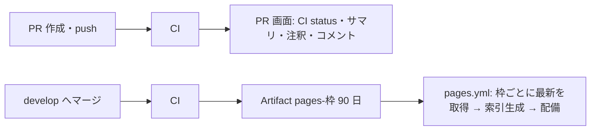

# CI/CD の構成

## ワークフロー

| ファイル | 契機 | 役割 |
| --- | --- | --- |
| `ci.yml` | develop 向け PR / develop への push / 毎週月曜 06:00 JST / 手動 | 変更のあったプロジェクトだけ検査し、レポートを Artifact `pages-<枠>` に出す。まとめは `CI status` |
| `pages.yml` | develop の `CI` 完了 (`workflow_run`) / 手動 | 枠ごとに最新の develop の Artifact を集め、索引画面を作って Pages へ配備 |
| `fe-quality.yml` | 再利用 | FE パッケージごとの検査 (matrix) |
| `be-quality.yml` | 再利用 | BE の検査 |
| `docs-build.yml` | 再利用 | Docusaurus のビルド (`BASE_URL` = Pages のパス + `docs/`) |

## 生成のタイミング

Pages に載るのは、**PR を develop にマージした後に develop で走る CI** の成果物です。
PR の CI は「その時点の develop に仮にマージした状態」で動くため、Pages には載せません。

```text
① PR を作成・push      → CI（PR 用）→ 結果は PR 画面、レポートは Artifact（14 日）。Pages には載せない
② PR を develop にマージ → CI（develop）→ Artifact pages-<枠>（90 日）※変更のあったプロジェクトのジョブだけ
③ ② の CI が完了       → pages.yml がサイトを組み立てて配備
```



## 変更のなかった枠の持ち越し

CI は変更のあったプロジェクトのジョブだけを実行します。Pages を毎回まるごと差し替えると、走らなかったジョブのレポートが消えてしまうため、
`pages.yml` は**枠ごとに**「その枠の Artifact を最後に出した develop の実行」を探して配置します。

- そのため、枠ごとに元コミットと生成日時が異なります。索引画面は枠ごとに表示し、7 日以上前のものは灰色にします
- 保持期間 (90 日) 内に出した実行がない枠は「⚠️ 成果物なし」と表示します。週 1 回の定期実行で全ジョブを走らせるので、期限切れは実質起きません

## Artifact の約束

| 項目 | 内容 |
| --- | --- |
| 名前 | `pages-<枠>` (例: `pages-be-jacoco`、`pages-fe-demo-fe-vitest`)。枠の一覧は `.github/scripts/report_common.py` の `build_catalog` |
| 中身 | Artifact の根 = その枠のサイトの根 (`index.html` を含む) |
| 要約 | `_pages/summary.json` (状態・件数・率・元コミット)。索引に使い、サイトからは取り除く |
| 保持 | develop 90 日 / PR 14 日 |

## 索引画面 (Pages のルート)

| 領域 | 内容 |
| --- | --- |
| ヘッダー | 最終配備 (JST)、配備元 (develop の CI の commit と実行へのリンク)、サイトのサイズ |
| ① 概況 | テスト件数・失敗・省略、BE / FE のカバレッジ率、静的解析の指摘数 |
| ② バックエンド | レポートごとに状態・結果・元コミット・生成日時・開く |
| ③ フロントエンド | パッケージごとに各レポートの状態とボタン。狭い画面ではカードに組み替え |
| ④ ドキュメント・推移 | このサイトと ci-metrics (gh-pages ブランチにあれば) |
| ⑤ 案内 | PR・ブランチの結果は PR 画面で見ることの案内 |

状態は ✅ 成功 / 🟡 警告あり / ❌ 失敗 (失敗した実行のレポートも載せる) / ⚠️ 成果物なし / ➖ 対象外 / ✂️ 容量のため省略 です。
同じ内容を `site.json` にも出力します。

## 容量の予算

Pages のサイトは 1 GB までです。サイト全体を **950 MB** (`PAGES_BUDGET_MB`) に収め、超えるときは priority の低い枠から省いて「✂️ 容量のため省略」と表示します (件数・率は概況に数えます)。
800 MB を超えると配備ジョブで警告を出します。

| 枠 | priority |
| --- | --- |
| docs | 100 |
| テスト結果 (BE tests / FE Vitest) | 80 |
| BE JaCoCo | 70 |
| FE Storybook | 60 |
| Javadoc | 40 |
| Checkstyle / SpotBugs / ESLint | 35 |
| npm audit | 30 |
| SLOC | 20 |

## 品質ゲート

次のいずれかでジョブが失敗し、`CI status` が ❌ になります。

- ESLint のエラー、Vitest / JUnit のテスト失敗、Storybook のビルド失敗
- Checkstyle の `error` 重大度の違反、SpotBugs の High
- Javadoc / Docusaurus の生成失敗 (Docusaurus はリンク切れも失敗)

カバレッジ 80% 未満・npm audit・各種 warning は 🟡 の表示のみです。条件は `.github/scripts/ci_report.py` で変更できます。
